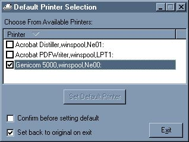



## Set Default Printer for Windows

### Description

Set the default printer for Windows at runtime that remains even after the app shuts down. All printers on the user's system will be displayed in a sortable listview from which printer selection can be made. Something like this is useful because the VB DataReport always prints to the default printer.
 
### More Info
 

             |
---                |---
**Submitted On**   |2003-09-11 06:16:16
**By**             |[CubeSolver](https://github.com/Planet-Source-Code/PSCIndex/blob/master/ByAuthor/cubesolver.md)
**Level**          |Beginner
**User Rating**    |5.0 (25 globes from 5 users)
**Compatibility**  |VB 6\.0
**Category**       |[Miscellaneous](https://github.com/Planet-Source-Code/PSCIndex/blob/master/ByCategory/miscellaneous__1-1.md)
**World**          |[Visual Basic](https://github.com/Planet-Source-Code/PSCIndex/blob/master/ByWorld/visual-basic.md)
**Archive File**   |[Set\_Defaul1644299112003\.zip](https://github.com/Planet-Source-Code/cubesolver-set-default-printer-for-windows__1-48417/archive/master.zip)

